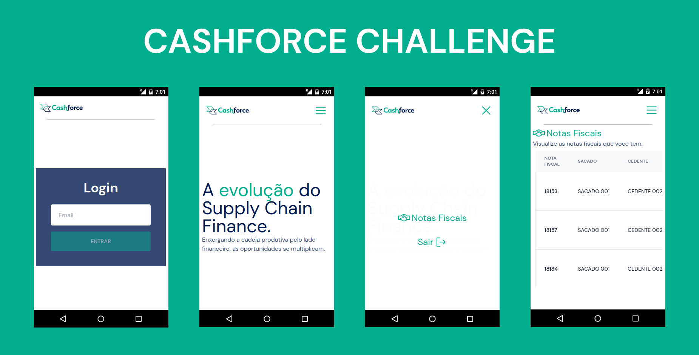
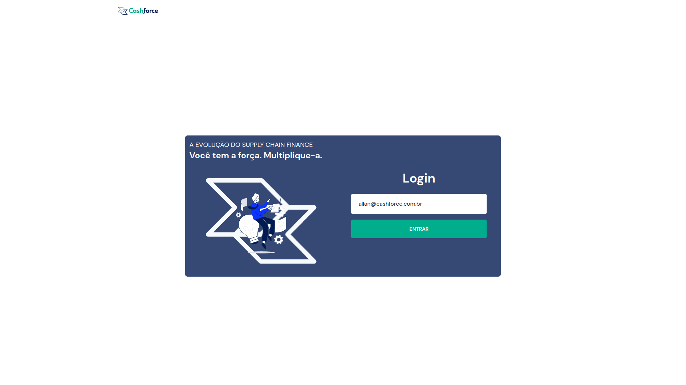
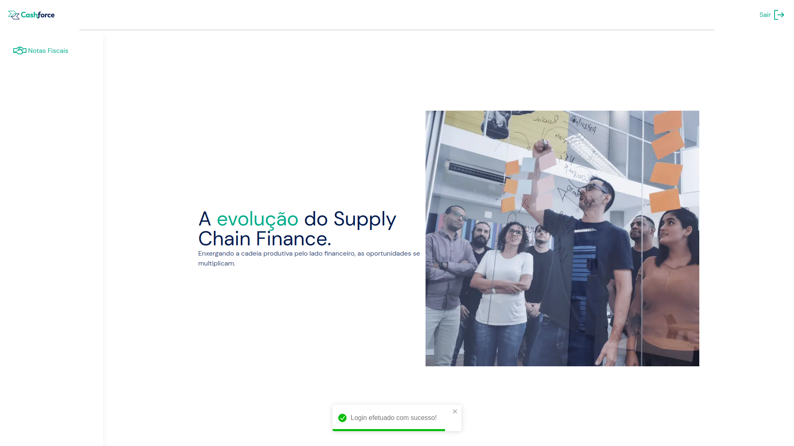
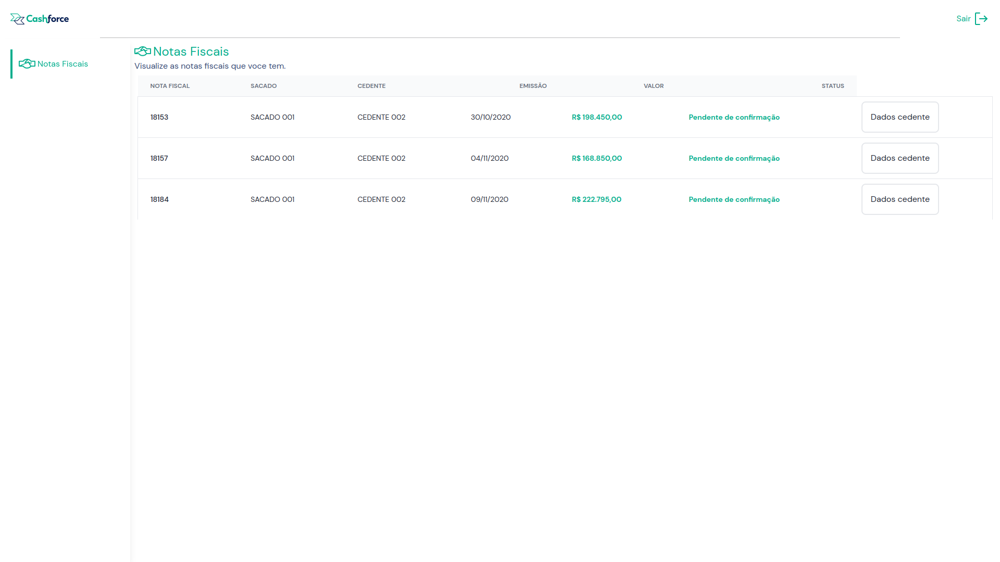
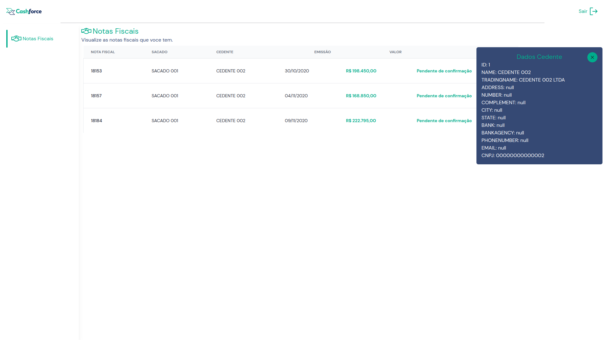
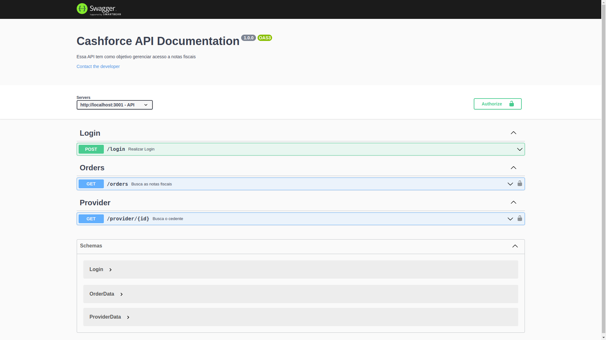
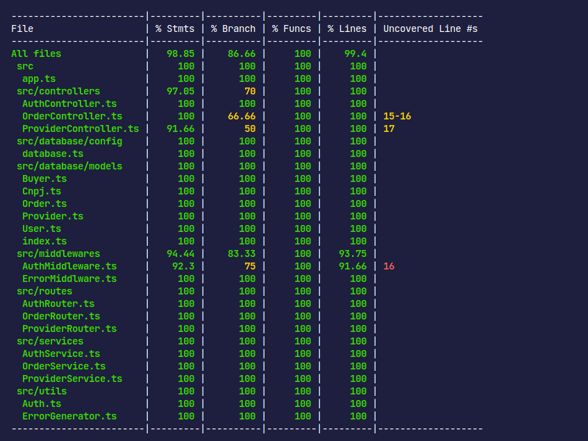

<h1 align="center">
    
    <br>
</h1>
<h4 align="center">
  Este é um desafio técnico realizado para a Cashforce com o intuito de ocupar a vaga de desenvolvedor fullstack jr.
</h4>

## 🚀 Tecnologias

Esse projeto foi desenvolvido com as seguintes tecnologias:

- **Backend**
  - Express
  - SequelizeORM
  - Banco de dados MySQL
  - Jwt
  - TypeScript
  - Docker
  - Swagger-UI
  - Mocha
  - Chai
  - ESLint
- **FrontEnd**
  - ReactJs
  - TypeScript
  - TailwindCSS
  - Axios
  - Nookies
  - ESLint
  - Phosphor-react
  - React-toastify
  - Docker

## 🛠️ Como instalar

⚠️ **Atenção**: Você precisa ter o docker e o docker-compose instalados em sua máquina para rodar o projeto.

**#Clonar este repositório**

```
git clone https://github.com/edersonlucas/cashforce-challenge
```

**#Entre na pasta do projeto**

```
cd cashforce-challenge
```

**#Renomeie o arquivo ".env.example" que está na pasta raiz do projeto para ".env"**

**#Agora que você renomeou arquivo de variaveis para ".env" rode o seguinte comando (Pode demorar alguns minutos ☕)**[](https://emojipedia.org/pt/café/)

    docker compose up

**#Você pode abrir o aplicativo e a documentação da API em:**

 ⚠️**Atenção**: Ao abrir a aplicação você caira em uma tela de login e será solicitado um email. O email para realizar o login é **"allan@cashforce.com.br"**.

```
Aplicação: http://localhost:3000
Documentação: http://localhost:3001/api-docs
```

**#Para executar os testes de cobertura do backend, use os seguintes comandos:**

```
docker exec -it backend /bin/sh
npm run test:coverage
```








#### [🚨](https://emojiterra.com/pt/luz-giratoria/) Em caso de dúvida, entre em contato..

[Email](edersonlucas@outlook.com.br)

[Linkedin](https://www.linkedin.com/in/edersonlucas/)

---

Desenvolvido por: [Ederson Lucas](https://www.linkedin.com/in/edersonlucas/)
